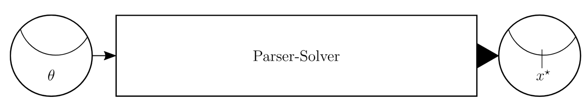
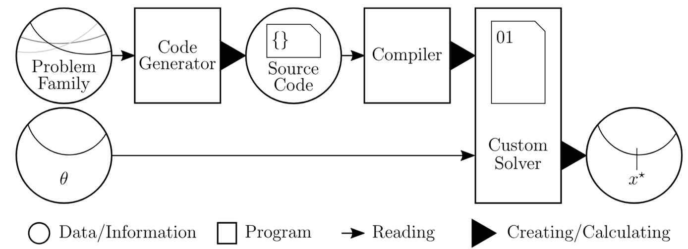

# CVXPYgen: Code generation with CVXPY

```{toctree}
:maxdepth: 1
:hidden:

install
user-guide
api-documentation
examples/index
contributing
changelog
faq
resources
```

```{raw} html
<script type="application/ld+json">
{
   "@context" : "https://schema.org",
   "@type" : "WebSite",
   "name" : "CVXPY",
   "url" : "https://www.cvxpy.org/"
}
</script>
```

```{raw} html
<div style="text-align: center; margin: 20px 0;">
  <a href="https://discord.gg/4urRQeGBCr" 
     target="_blank" 
     style="display: inline-block; 
            background: linear-gradient(135deg, #5865F2, #7289DA); 
            color: white; 
            padding: 12px 24px; 
            border-radius: 25px; 
            text-decoration: none; 
            font-weight: bold; 
            box-shadow: 0 4px 15px rgba(88, 101, 242, 0.3);
            transition: all 0.3s ease;
            border: none;
            margin-right: 10px;"
     onmouseover="this.style.transform='translateY(-2px)'; this.style.boxShadow='0 6px 20px rgba(88, 101, 242, 0.4)';"
     onmouseout="this.style.transform='translateY(0)'; this.style.boxShadow='0 4px 15px rgba(88, 101, 242, 0.3)';">
    🚀 Join our CVXPY Discord Community
  </a>
  <p style="margin-top: 8px; font-style: italic; color: #666;">Discuss with fellow optimization enthusiasts.</p>
</div>
```

**CVXPYgen** is a tool for generating custom C code, suitable for embedded applications,
that solves a parametrized class of convex optimization problems.

## Installation

```
pip install cvxpygen
```

## About

**CVXPYgen** takes a convex optimization problem family modeled with **CVXPY** and
generates a custom solver implementation in C. This generated solver is specific to the
problem family and accepts different parameter values. In particular, this solver is
suitable for deployment on embedded systems. In addition, CVXPYgen creates a Python
wrapper for prototyping and desktop (non-embedded) applications.

**CVXPYgen** generated code is suitable for real-time control systems, such as used for
autonomous driving, dynamic energy management, real-time trading, precision landing
(e.g., all SpaceX Falcon 9 and Falcon Heavy landings).

Its predecessor, [CVXGEN](https://cvxgen.com/docs/index.html), has been used in [all SpaceX Falcon 9 first stage landings.](http://larsblackmore.com/nae_bridge_2016.pdf#%5B%7B%22num%22%3A75%2C%22gen%22%3A0%7D%2C%7B%22name%22%3A%22XYZ%22%7D%2C-68%2C792%2C0.850006%5D)


*Side boosters from a SpaceX Falcon Heavy rocket land at Cape Canaveral’s Landing Zone 1
and Landing Zone 2 in Florida on February 6, 2018. Photo credit: SpaceX*

## Architecture overview

An in-depth overview of **CVXPYgen** can be found in our [slides and manuscript](https://web.stanford.edu/~boyd/papers/cvxpygen.html).

&rarr; Parser-solvers compile a problem instance into a canonicalized problem instance, then solve it.

&rarr; Parser-solvers canonicalize *each time* the problem is solved.

*Almost all DSLs are parser-solvers!*



Code generators like **CVXPYgen** compile a problem family into source code for a *custom
solver*. This is useful for:

&rarr; Embedded applications, possibly with hard real-time deadlines

&rarr; Speeding up the solution of many different problem instances



**CVXPYgen** accepts CVXPY problems that are compliant with
[Disciplined Convex Programming (DCP)](https://www.cvxpy.org/tutorial/dcp/index.html).
DCP is a system for constructing mathematical expressions with known curvature from a
given library of base functions. CVXPY uses DCP to ensure that the specified
optimization problems are convex. In addition, problems need to be modeled according to
[Disciplined Parametrized Programming (DPP)](https://www.cvxpy.org/tutorial/advanced/index.html#disciplined-parametrized-programming). Solving a DPP-compliant problem repeatedly
for different values of the parameters can be much faster than repeatedly solving a new
problem.

As of today, **CVXPYgen** works with linear, quadratic, and second-order cone programs.
It also supports differentiating through quadratic programs and computing an
explicit solution to linear and quadratic programs.

## Example

We define a simple 'nonnegative least squares' problem, generate code for it, and solve the problem with example parameter values.

### 1. Generate Code

Let's step through the first part of [``examples/main.py``](https://github.com/cvxgrp/cvxpygen/blob/master/examples/main.py).
Define a convex optimization problem the way you are used to with CVXPY.
Everything that is described as ``cp.Parameter()`` is assumed to be changing between multiple solves.
For constant properties, use ``cp.Constant()``.

```python
import cvxpy as cp

m, n = 3, 2
x = cp.Variable(n, name='x')
A = cp.Parameter((m, n), name='A', sparsity=((0, 0, 1), (0, 1, 1)))
b = cp.Parameter(m, name='b')
problem = cp.Problem(cp.Minimize(cp.sum_squares(A @ x - b)), [x >= 0])
```

Specify the `name` attribute for variables and parameters to recognize them after generating code.
The attribute `sparsity` is a tuple of row and column indices of the nonzero entries of matrix `A`.
Parameter sparsity is only taken into account for matrices.

Assign parameter values and test-solve.

```python
import numpy as np

np.random.seed(0)
A.value = np.zeros((m, n))
A.value[0, 0] = np.random.randn()
A.value[0, 1] = np.random.randn()
A.value[1, 1] = np.random.randn()
b.value = np.random.randn(m)
problem.solve()
```

Generating C code for this problem is as simple as,

```python
from cvxpygen import cpg

cpg.generate_code(problem, code_dir='nonneg_LS', solver='SCS')
```

where the generated code is stored inside `nonneg_LS` and the `SCS` solver is used.
Next to the positional argument `problem`, all keyword arguments for the `generate_code()` method are summarized below.

| Argument         | Meaning       | Type          | Default       |
| -------------    | ------------- | ------------- | ------------- |
| `code_dir`       | directory for code to be stored in                                 | String          | `'CPG_code'`  |
| `solver`         | canonical solver to generate code with                             | String          | CVXPY default |
| `solver_opts`    | options passed to canonical solver                                 | Dict            | `None`        |
| `enable_settings`| enabled settings that are otherwise locked by embedded solver      | List of Strings | `[]`          |
| `unroll`         | unroll loops in canonicalization code                              | Bool            | `False`       |
| `prefix`         | prefix for unique code symbols when dealing with multiple problems | String          | `''`          |
| `wrapper`        | compile Python wrapper for CVXPY interface                         | Bool            | `True`        |
| `gradient`       | enable differentiation (works for linear and quadratic programs)   | Bool            | `False`       |

You can find an overview of the code generation result in `nonneg_LS/README.html`.

### 2. Solve & Compare

As summarized in the second part of [``examples/main.py``](https://github.com/cvxgrp/cvxpygen/blob/master/examples/main.py), after assigning parameter values, you can solve the problem both conventionally and via the generated code, which is wrapped inside the custom CVXPY solve method ``cpg_solve``.

```python
import time
import sys

# import extension module and register custom CVXPY solve method
from nonneg_LS.cpg_solver import cpg_solve
problem.register_solve('CPG', cpg_solve)

# solve problem conventionally
t0 = time.time()
val = problem.solve(solver='SCS')
t1 = time.time()
print('\nCVXPY\nSolve time: %.3f ms\n' % (1000*(t1-t0)))
print('Primal solution: x = [%.6f, %.6f]\n' % tuple(x.value))
print('Dual solution: d0 = [%.6f, %.6f]\n' % tuple(problem.constraints[0].dual_value))
print('Objective function value: %.6f\n' % val)

# solve problem with C code via python wrapper
t0 = time.time()
val = problem.solve(method='CPG', updated_params=['A', 'b'], verbose=False)
t1 = time.time()
print('\nCVXPYgen\nSolve time: %.3f ms\n' % (1000 * (t1 - t0)))
print('Primal solution: x = [%.6f, %.6f]\n' % tuple(x.value))
print('Dual solution: d0 = [%.6f, %.6f]\n' % tuple(problem.constraints[0].dual_value))
print('Objective function value: %.6f\n' % val)
```

The argument `updated_params` specifies which user-defined parameter values are new.
If the argument is omitted, all parameter values are assumed to be new.
If only a subset of the user-defined parameters have new values, use this argument to speed up the solver.

**Most solver settings can be specified as keyword arguments** like without code generation.
Here, we use `verbose=False` to suppress printing.
The list of changeable settings differs by solver and is documented in `<code_dir>/README.html` after code generation.

Comparing the standard and codegen methods for this example, both the solutions and objective values are close.
Especially for smaller problems like this, the new solve method ``'CPG'`` is significantly faster than solving without code generation.

### 3. Executable

In the C code, all of your parameters and variables are stored as vectors via Fortran-style flattening (vertical index moves fastest).
For example, the `(i, j)`-th entry of the original matrix with height `h` will be the `i+j*h`-th entry of the flattened matrix in C.
For sparse *parameters*, i.e. matrices, the `k`-th entry of the C array is the `k`-th nonzero entry encountered when proceeding
through the parameter column by column.

Before compiling the example executable, make sure that ``CMake 3.5`` or newer is installed.

On Unix platforms, run the following commands in your terminal to compile and run the program:

```bash
cd nonneg_LS/c/build
cmake ..
cmake --build . --target cpg_example
./cpg_example
```

On Windows, type:

```bash
cd nonneg_LS\c\build
cmake ..
cmake --build . --target cpg_example --config release
Release\cpg_example
```
